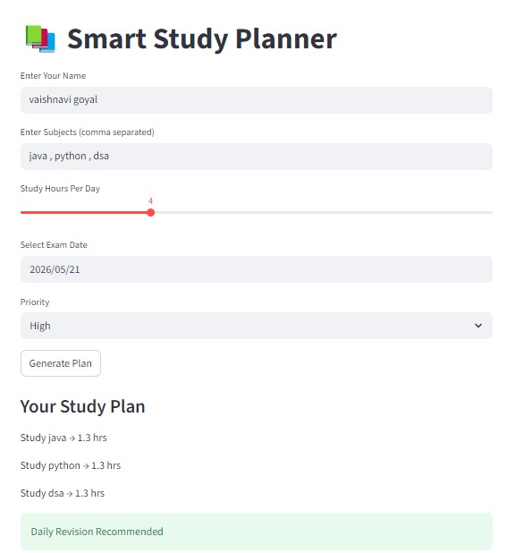

# Smart study planner
AI-inspired study planner that creates study schedules.

# Features
- Subject Input
- Exam Date Selection
- Study Hour Allocation
- Priority Based Planning

# Technologies
- Python
- Streamlit
- Pandas

# Run

```bash
streamlit run app.py
```

# Output


